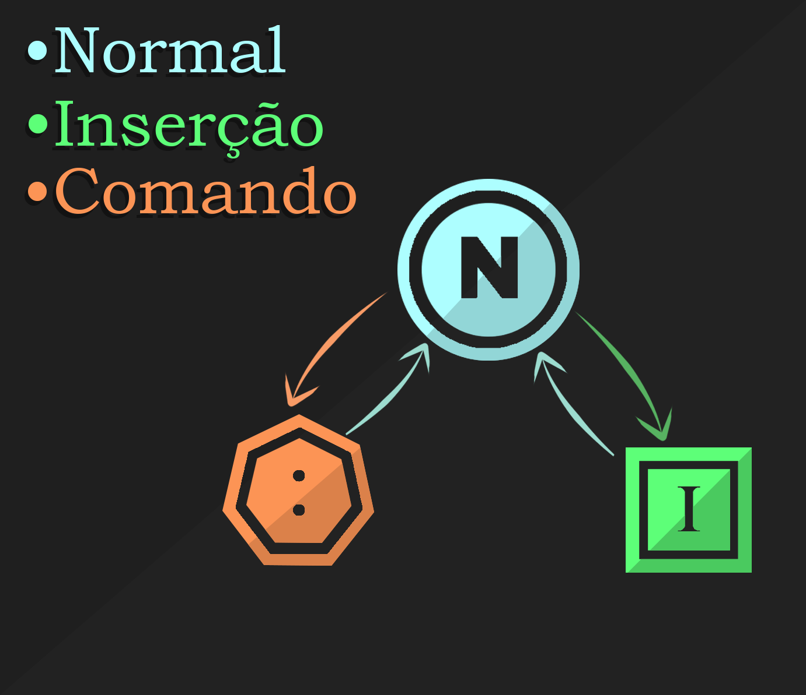
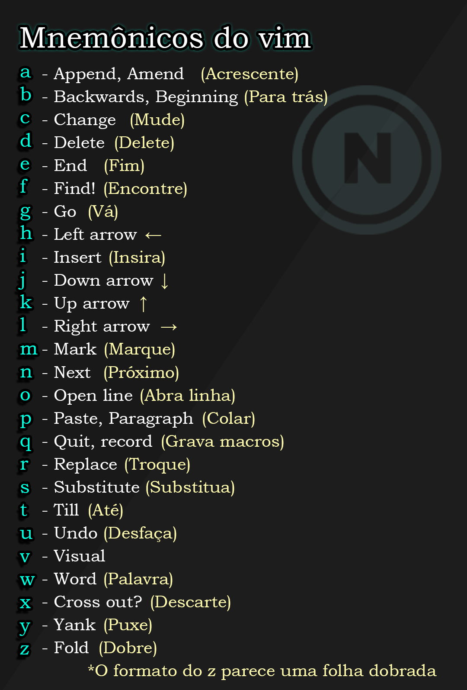

# Bem-VIMdo  
Esse é um repositório para auxiliar no começo da sua jornada de aprendizado sobre o Vim.  
## Sumário:
 - [Conhecendo o vim](#o-que-é-o-vim)
   - [Normal](#-normal)
   - [Inserção](#-inserção)
   - [Comando](#-comando)
 - [Mnemônicos](#mnemônicos)  
 - [Configurações (.vimrc)](#configurações)  
   - [Mapeamentos](#mapeamentos) 
 - [Como instalar plugins no vim](#instalando-plugins-no-vim) 
 - [Links úteis](#links-úteis)  

# O que é o Vim?  
Em poucas palavras, Vim é um editor de texto muito eficiênte e personalizável. O seu maior diferencial está em não necessitar do mouse, o que faz a manipulação e navegação do código ser feita por comandos do teclado, tornando os movimentos mais rápidos e precisos.

## Modos do Vim
O vim tem 3 modos principais:  

<div>
     
      
      
</div>  

🔵 **Normal:** Navegação e manipulação do texto.  
🟢 **Inserção:** Usado para escrita.  
🟠 **Comando:** Ações sobre o arquivo como salvar, sair, buscar, ...  

## 🔵 Normal  
O modo Normal é o modo principal do vim. É nele em que o editor se inicia e então, a partir dele, é possível ir para os outros 2 modos.  
  
Nesse modo cada tecla representa um comando. É possível associar um mnemônico para cada ação. 
Por exemplo:
| Atalho | Mnemônico | Ação |
| :---: | :---: | --- |
| `w` | word | Avança uma palavra |
| `u` | undo | Desfaz uma alteração |
| `i` | insert | Entra no modo de inserção |
|`r`| replace | Troca o caractere embaixo do cursor pelo próximo caractere digitado |

[Tabela de mnemônicos](#mnemônicos)

Ao juntar uma ação com um número N, o comando vai repetir N vezes.  
Exemplos:  
| Atalho | Ação |
| :---: | --- | 
| `2w` | Avança duas palavras |
| `4b` | Volta 4 palavras |

É possível também juntar as ações entre si, formando outros comandos:
| Atalho | Mnemônico | Ação |
| :---: | :---: | --- | 
| `dw` | delete word | Apaga uma palavra |
| `yi"` | yank inside " | Copia o conteúdo entre aspas duplas |
| `d2w` | delete 2 words | apaga duas palavras |
> A adição de um número para repetir o comando ainda é válida

## 🟢 Inserção  
O modo de inserção é utilizado para a escrita em si. Existem diversas formas de entrar nele através do modo normal, algumas formas vão ter mais eficiência do que outras dependendo da ocasião.

| Atalho | Mnemônico | Ação |
| :---: | :---: | --- | 
|`i`| insert | Insere à esquerda do cursor |
|`a`| append | Insere à direita do cursor |
|`I`| Insert | Insere à esquerda da primeira palavra da linha |
|`A`| Append | Insere à direita da última palavra da linha |
|`c<motion>`| change | Deleta até `<motion>` caracteres e entra no modo de inserção |
|`C`| Change | Deleta a partir do cursor até o final da linha e entra no modo de inserção |
|`s`| substitute| Deleta a letra embaixo do cursor e entra no modo de inserção |
|`S`| Substitute | Deleta a linha inteira e entra no modo de inserção |

## 🟠 Comando  
O modo de comando é equivalente ao menu do topo de outros programas. Para acessá-lo basta estar no modo normal e digitar `:`, `/` ou `?`.  
### Comando `:`
| Comando | Ação |
| :---: | --- |
|`:w`| Salva o arquivo |
|`:q`| Fecha a janela atual do editor |
|`:q!`| Fecha a janela atual do editor de forma forçada |
|`:wq`| Salva e fecha a janela atual |
|`:<número>`| Pula para a linha `<número>` |
|`:e <arquivo>`| Abre o arquivo `<arquivo>` |
|`:vs`| Divide a tela verticalmente em duas janelas |
|`:sp`| Divide a tela horizontalmente em duas janelas |

> Para navegar entre as janelas use o comando `<Ctrl+w>` seguido da direção (`h`, `j`, `k`, `l`, `←`, `↓`, `↑` ou `→`)  

### Comandos `?` e `/`
Faz uma busca do termo passado a partir do ponto atual do cursor (`?` para cima e `/` para baixo). Para se locomover entre as ocorrências do termo usa-se as teclas `n` (próxima ocorrência) e `N` (ocorrência anterior).
> Os comandos de locomoção se invertem caso a busca seja para cima.

# Mnemônicos
Lista de mnemônicos de cada letra no normal mode:   


# Configurações  

Ao inicializar o programa, o vim busca suas configurações no arquivo .vimrc, localizado por padrão no diretório home. Essas configurações modificam a visualização, comportamento, e atalhos do programa, moldando o editor às suas preferências e necessidades.

## Fazendo um .vimrc  
O arquivo é escrito em vimscript. Há um exemplo de configuração inicial [aqui](.vimrc) no repositório.
Algumas linhas úteis são:
```vim-script
" Coloca uma coluna que mostra a contagem de linhas à esquerda 
set nu
" Mesmo do set nu porém a contagem é relativa à posição do cursor 
set rnu
" Ativa o destaque da sintaxe do editor
syntax on 
" Tamanho do tab, nesse caso 4
set tabstop=4
" Tamanho da indentação usando << e >> (Bom deixar igual do tabstop)
set shiftwidth=4
" Destaca a coluna 80 (Boa prática não ultrapassar essa marca)
set colorcolumn=80
" Destaca a linha atual do cursor
set cursorline
" Destaca a coluna atual do cursor
set cursorcolumn
```
### Mapeamentos
Mapeamentos são a junção de teclas (ou apenas uma) que geram uma sequência de comandos definidos pelo usuário dentro do .vimrc.
A sintaxe é a seguinte:
`<tipo de map>  <gatilho>  <comandos>`  
Exemplos:  

```vim-script
nnoremap <S-d> d2w 
```
Nesse caso,
- `nnoremap` indica que é um mapeamento para o modo normal sem sobrescrever outros maps
- `<S-d>` o gatilho é shift + d
- `d2w` o comando é d2w, apaga duas palavras  

```vim-script
nnoremap <C-s> :w<CR> 
```

- `nnoremap` mapeamento para o modo normal
- `<C-s>` o gatilho é Ctrl + s  
- `:w<CR>` o comando é digitar `:w` e em seguida um enter `<CR>`, salvando o arquivo.

### Para criar maps para outros modos:  
- `inoremap` -> map para modo de inserção sem sobrescrever   
- `vnoremap` -> map para modo visual sem sobrescrever  
- `tnoremap` -> map para modo terminal sem sobrescrever  

### Gatilhos: 
| Gatilho | O que representa |
| :---: | --- |
| `<S-x>` | Shift + x    |
| `<C-x>` | Ctrl + x  |
| `<A-x>` | Alt + x  |
| `<Space-x>` | Espaço + x  |
| `xx` | xx  |
> Não precisa necessariamente usar uma tecla modificadora (Ctrl, Alt, Shift, ...) 

### Comandos  
Os comandos podem ser qualquer sequência que você faria manualmente:  
| Modo atual | Comando | Ação |
| :---: | :---: | --- |
| Normal | `:q<CR>` | Entra no modo comando, escreve `q`, e aperta enter |
| Normal | `i vim é brabo <Esc>` | Entra no modo de inserção, escreve "vim é brabo", e aperta Esc |
| Normal | `<C-w>l` | Vai para a janela à direita de um split |
| Normal | `mmgg=G'mzz` | Passa a auto indentação do vim pelo arquivo inteiro, e volta pra linha que o cursor estava |

# Plugins  
  Os plugins são a cereja do bolo. Através deles, se abre um leque de opções para personalizar e moldar o editor do seu jeito de uma maneira mais fácil. Além disso, alguns plugins como LSP e Telescope aumentam muito a eficiência em codar e ter um uso mais fluído.

## Instalando plugins no vim
1- Baixe o vim-plug com o seguinte comando:

```sh
curl -fLo ~/.vim/autoload/plug.vim --create-dirs \
    https://raw.githubusercontent.com/junegunn/vim-plug/master/plug.vim
```
2- Dentro do seu .vimrc escreva:

```vim
call plug#begin()

call plug#end()
```
3- Para adicionar plugins basta, colocá-los entre aspas simples da seguinte forma:

```vim
call plug#begin()
   Plug 'morhetz/gruvbox'
   Plug 'preservim/nerdtree'
call plug#end()
```
 Os plugins vêm de repositórios git. É possível usar o link inteiro ou a abreviação 'nome de usuário/ repositório do criador'
```vim
   Plug 'https://github.com/morhetz/gruvbox'  
   Plug 'morhetz/gruvbox'
```
4- Salve o arquivo `:w`, o recarregue `:so`, e então rode o comando `:PlugInstall`.  
Pronto, os plugins estão instalados :)  

[↑ Ir pro começo ↑](#bem-vimdo)   

## Links úteis
### Aprender sobre o Vim
   - <a href="https://vim.rtorr.com" target="_blank">Vim Cheat Sheet</a>
   - <a href="https://www.youtube.com/playlist?list=PLm323Lc7iSW_wuxqmKx_xxNtJC_hJbQ7R" target="_blank">Playlist de vídeos do The Primeagen sobre Vim</a>
   - <a href="https://dev.to/prodopsio/vim-a-to-z-literally-1iah" target="_blank">dev.to/prodopsio/vim-a-to-z-literally-1iah</a>
### Temas de cores
   - <a href="https://github.com/catppuccin/vim" target="_blank">Catpuccin</a>
   - <a href="https://github.com/sainnhe/everforest" target="_blank">Everforest</a>
   - <a href="https://github.com/morhetz/gruvbox" target="_blank">Gruvbox</a>
   - <a href="https://github.com/savq/melange-nvim" target="_blank">Melange (apenas Neovim)</a>
   - <a href="https://github.com/folke/tokyonight.nvim" target="_blank">TokyoNight (apenas Neovim)</a>
### Plugins interessantes
   - <a href="https://github.com/junegunn/vim-plug" target="_blank" >Vim-Plug (Gerenciador para os demais plugins)</a>
   - <a href="https://github.com/vim-airline/vim-airline" target="_blank">Vim Airline</a>
   - <a href="https://github.com/preservim/nerdtree" target="_blank">NERDtree</a>
   - <a href="https://github.com/luochen1990/rainbow" target="_blank">Rainbow Parenthesis Improved</a>
   - <a href="https://github.com/jiangmiao/auto-pairs" target="_blank">Auto Pairs</a>
   - <a href="https://github.com/dense-analysis/ale" target="_blank">ALE (Asynchronous Lint Engine)</a>
   > Recomendamos o ALE apenas para quando você já tiver desenvolvido mais prática com programação.
